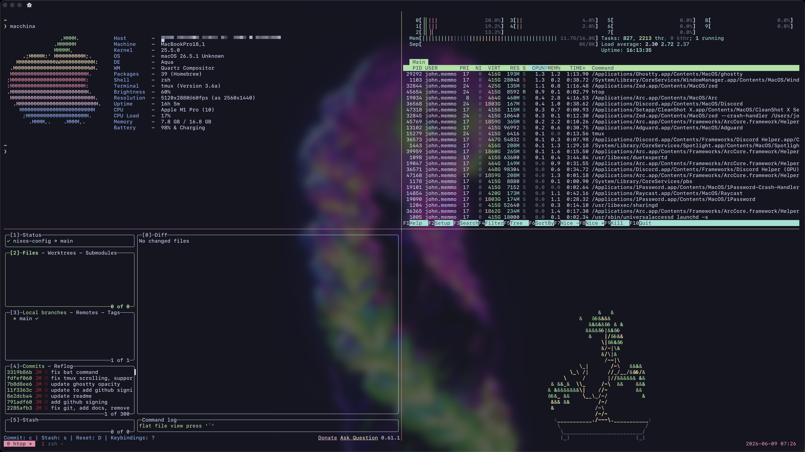

# RATIU5' macOS Nix Config



A reproducible **Apple Silicon macOS** setup, declared with
[nix-darwin](https://github.com/LnL7/nix-darwin) +
[home-manager](https://github.com/nix-community/home-manager). One script takes a
fresh Mac or VM to a fully configured machine — packages, GUI apps, dock, shell,
git, editor, and encrypted secrets via [agenix](https://github.com/ryantm/agenix).

Everything that makes the machine _yours_ — your name, email, and accounts —
lives in a single file: [`config.nix`](./config.nix). Fork it, edit that one
file, point it at your secrets repo, run `./setup.sh`. Done.

**Highlights**

- **Apple Silicon only** — enforced by a build-time assertion and a `setup.sh` guard
- **Declarative packages** + Homebrew casks, deduplicated per-user via home-manager
- **Batteries-included Zsh**: starship, zoxide, fzf, atuin, eza, autosuggestions
- **[Helix](https://helix-editor.com)** wired for ~25 languages (LSPs + formatters), with per-project runtimes via [mise](https://mise.jdx.dev)
- **One passphraseless** agenix key bootstraps every machine
- **Catppuccin Mocha** across Ghostty, Helix, Yazi, tmux, fzf, and starship — themed for **transparency**, so backgrounds inherit Ghostty's translucent/blurred window (see [Theming](#theming))

## Layout

```
config.nix            # YOUR settings: name, email, machines (edit this)
setup.sh              # one-shot bootstrap
flake.nix             # inputs (incl. secrets repo URL) + outputs
apps/<arch>-darwin/   # build / build-switch / rollback / clean
hosts/darwin/         # system config
modules/shared/       # cross-machine: packages, home-manager
modules/darwin/       # macOS: casks, dock, secrets
```

## What's inside

Packages are defined in `modules/shared/packages.nix` (cross-platform),
`modules/darwin/packages.nix` (macOS-only), and `modules/darwin/casks.nix` (GUI
apps). The lists below are a snapshot — the `.nix` files are the source of truth.

<details>
<summary><strong>CLI &amp; TUI tools</strong></summary>

| Tool            | Purpose                           |
| --------------- | --------------------------------- |
| `act`           | Run GitHub Actions locally        |
| `aspell` (+en)  | Spell checker                     |
| `atuin`         | Shell history with search/sync    |
| `bat`           | `cat` with syntax highlighting    |
| `biome`         | JS/TS/JSON/CSS formatter + linter |
| `btop` / `htop` | System / process monitors         |
| `coreutils`     | GNU core utilities                |
| `delta`         | Syntax-highlighting git pager     |
| `difftastic`    | Structural diff                   |
| `direnv`        | Per-directory environments        |
| `dust`          | Disk usage analyzer               |
| `eza`           | Modern `ls`                       |
| `fd`            | Fast `find`                       |
| `ffmpeg`        | Multimedia framework              |
| `fzf`           | Fuzzy finder                      |
| `gh`            | GitHub CLI                        |
| `gitleaks`      | Secret scanner                    |
| `glow`          | Terminal markdown renderer        |
| `iftop`         | Network bandwidth monitor         |
| `jq`            | JSON processor                    |
| `lazygit`       | Git TUI                           |
| `lazydocker`    | Container TUI (podman)            |
| `macchina`      | System info fetch                 |
| `mise`          | Per-project runtime manager       |
| `mkcert`        | Local HTTPS certs                 |
| `ngrok`         | Secure tunnels                    |
| `pandoc`        | Document converter                |
| `ripgrep`       | Fast text search                  |
| `sd`            | Intuitive find/replace            |
| `sesh`          | tmux session manager              |
| `ast-grep`      | Structural code search/refactor   |
| `tmux`          | Terminal multiplexer              |
| `tree`          | Directory tree                    |
| `uv`            | Python package installer          |
| `watchexec`     | Run command on file change        |
| `wget`          | File downloader                   |
| `xh`            | Fast HTTP client                  |
| `yazi`          | File manager                      |
| `zoxide`        | Smarter `cd`                      |

</details>

<details>
<summary><strong>Editors, languages &amp; container tooling</strong></summary>

| Category                            | Tools                            |
| ----------------------------------- | -------------------------------- |
| Editors                             | `helix`, `zed-editor`            |
| Language runtimes (also via `mise`) | `bun`, `go`, `nodejs_24`, `odin` |
| Dev environments / containers       | `devenv`, `podman`               |

**Helix language servers & formatters** (auto-wired once on PATH):

| Language                   | LSP                                       | Formatter                             |
| -------------------------- | ----------------------------------------- | ------------------------------------- |
| TS / JS / JSX / TSX        | `typescript-language-server`              | biome                                 |
| Astro                      | `astro-language-server`                   | biome                                 |
| Svelte                     | `svelte-language-server`                  | biome                                 |
| HTML / CSS / JSON / ESLint | `vscode-langservers-extracted`            | biome                                 |
| Tailwind / Emmet           | `tailwindcss-language-server`, `emmet-ls` | —                                     |
| YAML                       | `yaml-language-server`                    | —                                     |
| Markdown                   | `marksman`                                | —                                     |
| TOML                       | `taplo`                                   | taplo                                 |
| GraphQL                    | `graphql-language-service-cli`            | biome                                 |
| Dockerfile                 | `dockerfile-language-server`              | —                                     |
| Bash                       | `bash-language-server`                    | `shfmt` (+ `shellcheck`)              |
| Lua                        | `lua-language-server`                     | `stylua`                              |
| SQL                        | `sqls`                                    | —                                     |
| Python                     | `ruff`, `pyright`                         | ruff                                  |
| Rust                       | `rust-analyzer`                           | rustfmt (mise toolchain)              |
| PHP                        | `phpactor`                                | —                                     |
| Nix                        | `nixd`                                    | `nixpkgs-fmt` (+ `statix`, `deadnix`) |
| Go                         | `gopls`, `golangci-lint-langserver`       | gofmt                                 |
| Liquid (Shopify)           | `shopify-cli` theme LSP                   | —                                     |
| Odin                       | `ols` (built from source, see below)      | `odinfmt`                             |

Extra linter: `oxlint`. Odin's `ols` isn't in nixpkgs (build broken against
current Odin) — `setup.sh` builds it from source automatically.

</details>

<details>
<summary><strong>GUI apps (Homebrew casks)</strong></summary>

| Cask              | Purpose                       | Profiles  |
| ----------------- | ----------------------------- | --------- |
| `arc`             | Browser                       | all\*     |
| `zen`             | Browser                       | all\*     |
| `yaak`            | API client                    | all\*     |
| `1password`       | Password manager              | all\*     |
| `figma`           | Design                        | all\*     |
| `tailscale-app`   | Mesh VPN                      | all\*     |
| `jordanbaird-ice` | Menu-bar item manager         | all\*     |
| `stats`           | Menu-bar system monitor       | all\*     |
| `localsend`       | Cross-platform file transfer  | all\*     |
| `adguard`         | Network-wide ad blocker       | all\*     |
| `affinity`        | Design / SEO                  | all\*     |
| `homerow`         | Keyboard-driven UI navigation | all\*     |
| `raycast`         | Launcher                      | all\*     |
| `setapp`          | App subscription manager      | all\*     |
| `obsidian`        | Notes / knowledge base        | all\*     |
| `discord`         | Communication                 | all\*     |
| `zoom`            | Video conferencing            | all\*     |
| `slack`           | Work comms                    | work only |

\*all = `work` and `personal`. The `vm` profile installs **no** casks.

</details>

<details>
<summary><strong>Fonts &amp; managed programs</strong></summary>

| Category              | Items                                                                                                       |
| --------------------- | ----------------------------------------------------------------------------------------------------------- |
| Fonts                 | `jetbrains-mono`, `meslo-lgs-nf`, `hack-font`, `font-awesome`, `dejavu_fonts`, `noto-fonts` (+ color emoji) |
| home-manager programs | `zsh`, `git`, `tmux`, `vim`, `ssh`, `starship`, `zoxide`, `fzf`, `atuin`, `direnv`                          |

</details>

## Theming

Everything is **Catppuccin Mocha**, themed to preserve terminal transparency.
Ghostty runs at `background-opacity = 0.70` with background blur, so the rule for
every tool is the same: **theme the foreground and accents, but leave the base
background as the terminal default** — never paint it with Catppuccin's opaque
`#1e1e2e`. That way the translucent window shows through everywhere.

| Tool         | Where it lives                                   | How transparency is kept                                      |
| ------------ | ------------------------------------------------ | ------------------------------------------------------------- |
| **Ghostty**  | `dotfiles/config/ghostty/config`                 | `theme = Catppuccin Mocha` + `background-opacity = 0.70`      |
| **tmux**     | `dotfiles/config/tmux/tmux.conf`                 | Mocha hexes inline; status/window styles use `bg=default`     |
| **fzf**      | `modules/shared/home-manager.nix` (`programs.fzf`) | Mocha `--color` flags with `bg:-1` (terminal background)    |
| **Helix**    | `dotfiles/config/helix/themes/catppuccin_opaque.toml` | custom variant; swap to stock `catppuccin_mocha` for clear bg |
| **Yazi**     | `dotfiles/config/yazi/theme.toml`                | Mocha hexes; no full-window background fill                   |
| **starship** | `dotfiles/config/starship.toml`                  | `palette = "catppuccin_mocha"` (prompt only, no bg)           |
| **bat**      | `dotfiles/config/bat/bat.conf`                   | `--theme="base16"` inherits the terminal's Catppuccin palette |

### Adding Catppuccin to another tool

Most CLI tools have an [official Catppuccin port](https://github.com/catppuccin).
The general recipe, keeping transparency:

- **btop** — drop the Mocha theme from [`catppuccin/btop`](https://github.com/catppuccin/btop)
  into `dotfiles/config/btop/themes/`, set `color_theme` in `btop.conf`, and edit
  the theme's `theme[main_bg]=""` so the background stays transparent.
- **lazygit** — add the [`catppuccin/lazygit`](https://github.com/catppuccin/lazygit)
  Mocha `gui.theme` block to its `config.yml`; it sets borders/selection only (no
  base background), so it's transparent by default.
- **delta** — `include` the `catppuccin.gitconfig` from
  [`catppuccin/delta`](https://github.com/catppuccin/delta) and set
  `delta.features = catppuccin-mocha` in the git config.

Vendor the theme file under `dotfiles/config/<tool>/` (it auto-links to
`~/.config/<tool>/`), `git add` it, then `nix run .#build-switch`. Tools that
cache compiled themes (`bat`, `btop`) need their cache rebuilt once after.

## Making it yours

Everything personal lives in **`config.nix`** — name, email, and the `machines`
map (build label → macOS user). Edit that one file. Use a GitHub-**verified**
email so your `id_agenix`-signed commits show as Verified (see
[Commit signing](#commit-signing)).

The **one** thing that can't live in `config.nix` is the private secrets repo
URL. Nix evaluates the flake `inputs` block before any expression runs, so an
input URL _must_ be a string literal — it cannot read `config.nix`. Point
`inputs.secrets.url` in `flake.nix` at your own repo (see the forking section
below). Everything else is derived from `config.nix`.

## Secrets, briefly

Secrets live encrypted in a private `nix-secrets` repo and are decrypted at build
time by `~/.ssh/id_agenix` — one passphraseless key that does two jobs: pulls
`nix-secrets` (it's on GitHub) and decrypts the `.age` files (it's a recipient in
`secrets.nix`). Same key on every machine, so a new machine is just "drop the key,
build." The key lives in 1Password.

## Setting up your own secrets repo (forking)

If you forked this, you need your own `nix-secrets` repo before the build will
work. It's quick — a private repo with a `secrets.nix` recipient list and the
`.age` file this config expects (`github-ssh-key` — see
`modules/darwin/secrets.nix`; add or remove to taste).

```sh
# 1. Make the shared key (one time, ever) and save it in 1Password.
ssh-keygen -t ed25519 -N "" -C agenix -f ~/.ssh/id_agenix
gh ssh-key add ~/.ssh/id_agenix.pub --title "agenix"   # so it can pull the repo

# 2. Create the private repo.
gh repo create nix-secrets --private --clone
cd nix-secrets
```

Add a `secrets.nix` listing the key as the recipient for every secret:

```nix
let
  shared = "ssh-ed25519 AAAA...";   # paste the contents of ~/.ssh/id_agenix.pub
in
{
  "github-ssh-key.age".publicKeys = [ shared ];
}
```

Encrypt each secret (opens an editor — paste the value, save, quit), commit, push:

```sh
EDITOR=vim nix run github:ryantm/agenix -- -e github-ssh-key.age
git add -A && git commit -m "init secrets" && git push
```

Finally point this config at it: set `inputs.secrets.url` in `flake.nix` to
`git+ssh://git@github.com/<you>/nix-secrets.git`. Now `setup.sh` will build.

## First-time setup (new machine)

```sh
git clone https://github.com/RATIU5/nixos-config.git ~/Developer/nixos-config
cd ~/Developer/nixos-config
```

Drop the shared key from 1Password. This is **required** — agenix decrypts
secrets at build time with it, and `setup.sh` refuses to run without it (it
won't generate one, since a fresh key can't decrypt the existing secrets):

```sh
mkdir -p ~/.ssh && chmod 700 ~/.ssh
# paste private -> ~/.ssh/id_agenix , public -> ~/.ssh/id_agenix.pub
chmod 600 ~/.ssh/id_agenix
chmod 644 ~/.ssh/id_agenix.pub
```

Make sure GitHub knows the key as an **Authentication key** (once per key, not per
machine) — `ssh -T git@github.com` should greet you. If not:

```sh
gh ssh-key add ~/.ssh/id_agenix.pub --title "$(hostname)"
```

### Commit signing

Commits are signed with the same `id_agenix` key over SSH (`gpg.format = ssh` in
the git config) — passphraseless, so it never prompts, and no GPG/gpg-agent to
set up.

For the green **Verified** badge, two things must be true on GitHub:

1. **`id_agenix.pub` is registered as a _Signing key_.** GitHub tracks
   _Authentication_ and _Signing_ keys separately, so the key you already use to
   push (an Authentication key) does **not** verify commits. **It's the same
   public key** — just added a _second_ time with the type set to **Signing key**.
2. **Your commit email is a _verified_ email on that same account** (Settings →
   Emails). GitHub matches the committer email to the account that owns the
   signing key; an unverified or mismatched email shows as Unverified.

Easiest way — paste it in the web UI: GitHub → Settings → **SSH and GPG keys** →
**New SSH key** → set **Key type: Signing Key** → paste the contents of
`~/.ssh/id_agenix.pub`. Or via the CLI (note the extra scope — `gh auth login`
does **not** grant it by default):

```sh
gh auth refresh -h github.com -s admin:ssh_signing_key
gh ssh-key add ~/.ssh/id_agenix.pub --type signing --title "$(hostname)-signing"
```

Once both are in place, GitHub re-verifies at display time, so existing signed
commits flip to Verified too — no rebase needed.

Add this machine to the `machines` map in `config.nix` if your user isn't there,
then commit it (flakes ignore untracked files). The label is yours to pick; the
value is your macOS account name:

```nix
youruser = "youruser";
```

Run it:

```sh
./setup.sh
```

It installs the Xcode CLT and Nix if needed, then builds and switches.

### Grant your terminal Full Disk Access (required)

A few macOS system defaults this config sets live in SIP-protected preference
domains — most notably `com.apple.universalaccess` (reduce motion/transparency).
`defaults` can only write those if the terminal you run `build-switch` from has
**Full Disk Access**. Without it, activation fails partway with:

```
Could not write domain com.apple.universalaccess; exiting
```

and aborts _before_ the Homebrew step, so **casks never get installed**.

1. System Settings → Privacy & Security → **Full Disk Access**
2. Add and enable your terminal app (this config ships **Ghostty**; add Terminal/iTerm too if you bootstrap from them)
3. **Fully quit and reopen** the terminal — toggling the switch isn't enough, the process must restart to pick up the grant
4. Re-run `nix run .#build-switch`

This is a one-time, per-terminal-app grant. It can't be declared in Nix because
macOS gates these permissions through the TCC database, which requires explicit
user approval.

## Updating

```sh
nix run .#build-switch   # apply config changes
nix run .#rollback       # undo to previous generation
nix run .#clean          # gc old generations
nix flake update         # bump all inputs (or `nix flake update secrets`)
```

Edit a `.nix` file → `nix run .#build-switch`. New file → `git add` it first.

## Adding a secret

Say you want to stash a new SSH key, API token, or password. In the
`nix-secrets` repo:

```sh
cd ~/Developer/nix-secrets
```

Add it to `secrets.nix` with the shared key as recipient:

```nix
"my-api-token.age".publicKeys = [ shared ];   # `shared` is already defined up top
```

Create the encrypted file (opens an editor — paste the secret, save, quit):

```sh
EDITOR=vim nix run github:ryantm/agenix -- -e my-api-token.age
```

Tell the config where to drop it, in `modules/darwin/secrets.nix` under
`age.secrets`:

```nix
"my-api-token" = {
  file = "${secrets}/my-api-token.age";
  path = "/Users/${user}/.config/whatever/token";  # where it lands on disk
  mode = "600";
  owner = "${user}";
};
```

Commit the secret, then pull it into the config:

```sh
cd ~/Developer/nix-secrets && git add -A && git commit -m "add my-api-token" && git push
cd ~/Developer/nixos-config && nix flake update secrets && nix run .#build-switch
```

That's it — agenix decrypts it on every machine that has the shared key.

> Standing the whole thing up from scratch (no secrets repo yet)? See
> [Setting up your own secrets repo](#setting-up-your-own-secrets-repo-forking)
> above for creating the shared key and the repo.
