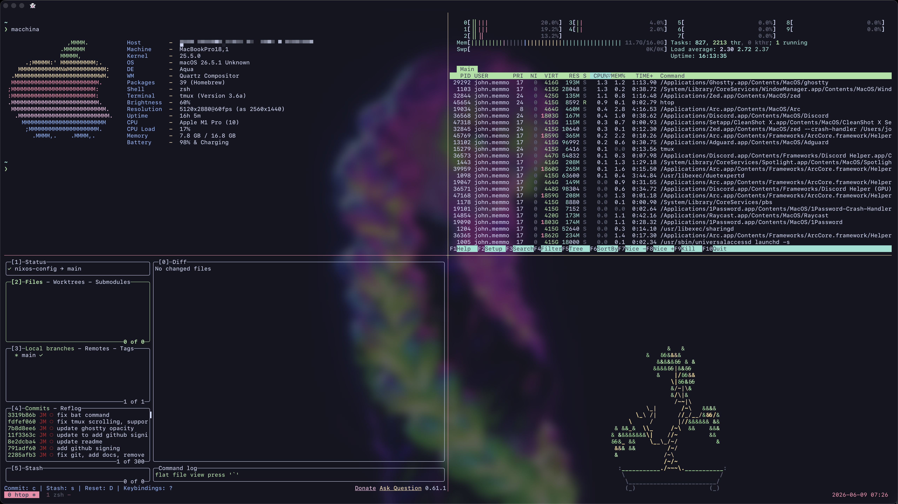

# RATIU5' macOS Nix Config



Reproducible **Apple Silicon macOS** setup using [nix-darwin](https://github.com/LnL7/nix-darwin) + [home-manager](https://github.com/nix-community/home-manager). Fork it, edit one file, run one script.

- Declarative packages + Homebrew casks via home-manager
- Zsh with starship, zoxide, fzf, atuin, eza, autosuggestions
- [Helix](https://helix-editor.com) pre-wired for ~25 languages (LSPs + formatters) via [mise](https://mise.jdx.dev)
- Encrypted secrets via [agenix](https://github.com/ryantm/agenix) — one passphraseless key per machine
- Second-brain Obsidian vault at `~/brain`, auto-cloned on activation from the private [`nix-ai-brain`](https://github.com/RATIU5/nix-ai-brain) repo (content lives in git, not Nix)
- Catppuccin Mocha across Ghostty, Helix, Yazi, tmux, fzf, and starship

## Layout

```
config.nix            # your settings: name, email, machines (edit this)
setup.sh              # one-shot bootstrap
flake.nix             # inputs + outputs (set your secrets repo URL here)
modules/shared/       # cross-machine: packages, home-manager
modules/darwin/       # macOS: casks, dock, secrets
dotfiles/config/      # tool configs (auto-linked to ~/.config/)
dotfiles/pi/          # pi coding-agent config (synced to ~/.pi on activation)
```

## What's inside

<details>
<summary><strong>CLI &amp; TUI tools</strong></summary>

| Tool            | Purpose                           |
| --------------- | --------------------------------- |
| `act`           | Run GitHub Actions locally        |
| `aspell` (+en)  | Spell checker                     |
| `atuin`         | Shell history with search/sync    |
| `bat`           | `cat` with syntax highlighting    |
| `biome`         | JS/TS/JSON/CSS formatter + linter |
| `btop` / `htop` | System / process monitors         |
| `coreutils`     | GNU core utilities                |
| `delta`         | Syntax-highlighting git pager     |
| `difftastic`    | Structural diff                   |
| `direnv`        | Per-directory environments        |
| `dust`          | Disk usage analyzer               |
| `eza`           | Modern `ls`                       |
| `fd`            | Fast `find`                       |
| `ffmpeg`        | Multimedia framework              |
| `fzf`           | Fuzzy finder                      |
| `gh`            | GitHub CLI                        |
| `gitleaks`      | Secret scanner                    |
| `glow`          | Terminal markdown renderer        |
| `herdr`         | Agent multiplexer (via mise)      |
| `iftop`         | Network bandwidth monitor         |
| `jq`            | JSON processor                    |
| `lazygit`       | Git TUI                           |
| `lazydocker`    | Container TUI (podman)            |
| `macchina`      | System info fetch                 |
| `mise`          | Per-project runtime manager       |
| `mkcert`        | Local HTTPS certs                 |
| `ngrok`         | Secure tunnels                    |
| `pandoc`        | Document converter                |
| `pi`            | AI coding agent (earendil-works)  |
| `ripgrep`       | Fast text search                  |
| `sd`            | Intuitive find/replace            |
| `sesh`          | tmux session manager              |
| `ast-grep`      | Structural code search/refactor   |
| `tmux`          | Terminal multiplexer              |
| `tree`          | Directory tree                    |
| `uv`            | Python package installer          |
| `watchexec`     | Run command on file change        |
| `wget`          | File downloader                   |
| `xh`            | Fast HTTP client                  |
| `yazi`          | File manager                      |
| `zoxide`        | Smarter `cd`                      |

</details>

<details>
<summary><strong>Editors, languages &amp; containers</strong></summary>

| Category                            | Tools                            |
| ----------------------------------- | -------------------------------- |
| Editors                             | `helix`, `zed-editor`            |
| Language runtimes (also via `mise`) | `bun`, `go`, `nodejs_24`, `odin` |
| Dev environments / containers       | `devenv`, `podman`               |

**Helix language servers & formatters:**

| Language                   | LSP                                       | Formatter                             |
| -------------------------- | ----------------------------------------- | ------------------------------------- |
| TS / JS / JSX / TSX        | `typescript-language-server`              | biome                                 |
| Astro                      | `astro-language-server`                   | biome                                 |
| Svelte                     | `svelte-language-server`                  | biome                                 |
| HTML / CSS / JSON / ESLint | `vscode-langservers-extracted`            | biome                                 |
| Tailwind / Emmet           | `tailwindcss-language-server`, `emmet-ls` | —                                     |
| YAML                       | `yaml-language-server`                    | —                                     |
| Markdown                   | `marksman`                                | —                                     |
| TOML                       | `taplo`                                   | taplo                                 |
| GraphQL                    | `graphql-language-service-cli`            | biome                                 |
| Dockerfile                 | `dockerfile-language-server`              | —                                     |
| Bash                       | `bash-language-server`                    | `shfmt` (+ `shellcheck`)              |
| Lua                        | `lua-language-server`                     | `stylua`                              |
| SQL                        | `sqls`                                    | —                                     |
| Python                     | `ruff`, `pyright`                         | ruff                                  |
| Rust                       | `rust-analyzer`                           | rustfmt (mise toolchain)              |
| PHP                        | `phpactor`                                | —                                     |
| Nix                        | `nixd`                                    | `nixpkgs-fmt` (+ `statix`, `deadnix`) |
| Go                         | `gopls`, `golangci-lint-langserver`       | gofmt                                 |
| Liquid (Shopify)           | `shopify-cli` theme LSP                   | —                                     |
| Odin                       | `ols` (built from source)                 | `odinfmt`                             |

</details>

<details>
<summary><strong>GUI apps (Homebrew casks)</strong></summary>

| Cask              | Purpose                       | Profiles  |
| ----------------- | ----------------------------- | --------- |
| `arc`             | Browser                       | all\*     |
| `zen`             | Browser                       | all\*     |
| `yaak`            | API client                    | all\*     |
| `1password`       | Password manager              | all\*     |
| `figma`           | Design                        | all\*     |
| `tailscale-app`   | Mesh VPN                      | all\*     |
| `jordanbaird-ice` | Menu-bar item manager         | all\*     |
| `stats`           | Menu-bar system monitor       | all\*     |
| `localsend`       | Cross-platform file transfer  | all\*     |
| `adguard`         | Network-wide ad blocker       | all\*     |
| `affinity`        | Design / photo editing        | all\*     |
| `homerow`         | Keyboard-driven UI navigation | all\*     |
| `raycast`         | Launcher                      | all\*     |
| `setapp`          | App subscription manager      | all\*     |
| `obsidian`        | Notes / knowledge base        | all\*     |
| `discord`         | Communication                 | all\*     |
| `zoom`            | Video conferencing            | all\*     |
| `slack`           | Work comms                    | work only |

\*all = `work` and `personal`. The `vm` profile installs no casks.

</details>

## pi coding agent

[`pi`](https://github.com/earendil-works/pi) (earendil-works) is installed as `pi-coding-agent` from [numtide/llm-agents.nix](https://github.com/numtide/llm-agents.nix) and configured from `dotfiles/pi/`.

**The pieces**

| Piece | Where | Managed by |
| ----- | ----- | ---------- |
| `pi` CLI | `modules/shared/packages.nix` (`pi-coding-agent`) | Nix |
| Settings / cloak / MCP / theme | `dotfiles/pi/agent/` → `~/.pi/agent/` | `home.activation.syncPiConfig` |
| Extensions workspace | `dotfiles/pi/agent/extensions/` → `~/.pi/agent/extensions/` | same activation + `bun install` |
| Herdr ↔ pi bridge | `~/.pi/agent/extensions/herdr-agent-state.ts` | `herdr integration install pi` (after mise + pi sync) |
| Runtime state | `~/.pi/agent/auth.json`, sessions | not managed (left alone) |

**Extensions shipped**

- Standalone: `answer`, `git-interceptor`, `whimsical`, `worker-configuration-guard`, `contextio-proxy`
- Packages: `pi-cloak`, `pi-skill-toggle`, `save-md`, `web-tools` (Exa; set `EXA_API_KEY`)
- External: `herdr-agent-state` (installed by Herdr; preserved across pi sync)

Skipped from the reference tree: `opencode-cloudflare`, personal MCP endpoints.

**ContextIO (automatic LLM redaction + logging)**

[`@contextio/cli`](https://github.com/larsderidder/contextio) is installed into `~/.npm-packages` and a background proxy is started on activation. The `contextio-proxy` extension rewrites anthropic/openai/google/**xai** baseUrls so pi traffic always goes through it (pi ignores `*_BASE_URL` env vars). xAI uses OpenAI-compat paths plus `x-target-url` → `api.x.ai`.

| Piece | Where | Managed by |
| ----- | ----- | ---------- |
| `ctxio` CLI | `~/.npm-packages` (`@contextio/cli`) | `home.activation.installContextio` |
| Background proxy | `127.0.0.1:4040` (redact preset `pii`) | `home.activation.ensureContextioProxy` + zsh `pi()` wrapper |
| Provider routing | `dotfiles/pi/agent/extensions/contextio-proxy.ts` | `syncPiConfig` |
| Captures | `~/.contextio/captures/` | contextio |

```bash
pi                        # ensures proxy is up (zsh wrapper), then launches
ctxio proxy status
ctxio monitor
ctxio inspect --last
CONTEXTIO_DISABLED=1 pi   # bypass
```

**After `build-switch`**

```bash
cd ~/.pi && bun install   # first time / after package.json changes (activation also tries this)
herdr integration status  # confirm pi integration is installed
ctxio proxy status        # confirm contextio is running
pi                        # then /reload after extension edits
```

Edit config under `dotfiles/pi/`, commit, re-run `nix run .#build-switch`.

## AI second brain (omp + Obsidian)

A terminal-first knowledge stack: [omp](https://github.com/can1357/oh-my-pi) (AI coding agent, installed via the `can1357/tap` brew) working against an Obsidian vault at `~/brain`.

**The pieces**

| Piece | Where | Managed by |
| ----- | ----- | ---------- |
| omp CLI | `brew` list in `modules/darwin/home-manager.nix` | Nix (declarative) |
| Obsidian app | `modules/darwin/casks.nix` | Nix (declarative) |
| Vault | `~/brain`, cloned from private [`nix-ai-brain`](https://github.com/RATIU5/nix-ai-brain) | `home.activation.cloneBrain` bootstraps; content is plain git |
| [obsidian-skills](https://github.com/kepano/obsidian-skills) | `~/.omp/agent/skills/` (5 skills: obsidian-markdown, obsidian-bases, json-canvas, obsidian-cli, defuddle) | imperative (copied) |
| [obsidian-second-brain](https://github.com/eugeniughelbur/obsidian-second-brain) | repo at `~/.local/share/obsidian-second-brain`, linked via `omp install ./dist/pi` | imperative |
| Pack config | `~/.config/obsidian-second-brain/.env` — `OBSIDIAN_VAULT_PATH=~/brain`, `OBSIDIAN_SEARCH_SEMANTIC=0` (keyword search only; flip to 1 later if it misses) | imperative |
| Global agent rules | `~/.omp/agent/AGENTS.md` (learning-mode rules; project copy at `~/brain/templates/AGENTS.project-template.md`) | imperative |

**Daily use**

```bash
cd ~/brain && omp        # start the agent from the vault root
```

Inside omp:
- `/obsidian-daily`, `/obsidian-save`, `/obsidian-find`, `/obsidian-recap`, … — second-brain commands (tab-complete `/obsidian-`)
- `/research`, `/research-deep`, `/youtube` — research toolkit (needs API keys in the `.env` above)
- `/skill:obsidian-second-brain` and `/skill:obsidian-markdown` etc. — skills load on demand
- `omp plugin list` / `omp plugin doctor` — verify the pack is registered

The AGENTS.md rules make omp teach as it works: it explains its approach and key tradeoff before non-trivial code, and asks you to predict behavior before revealing solutions. Capture what you learn with `~/brain/templates/learning-note.md` (Date / Task / What I predicted / What actually happened / Concept learned / What still confuses me / Link to code).

**Using the vault in Obsidian:** open Obsidian → *Open folder as vault* → `~/brain` (one-time; it remembers). omp and Obsidian share the same markdown files — no plugin needed; Obsidian live-reloads edits omp makes on disk. Sync is just git: commit/push in `~/brain`.

**Rebuilding a machine:** the Nix side (omp, Obsidian, vault clone) comes back automatically with `build-switch`; re-run the imperative pack installs above (kepano copy + `omp install`) by hand.

## Setup

### Forking (first time ever)

**1. Fork the repo**

Click **Fork** on GitHub, then clone your fork:

```sh
git clone https://github.com/<you>/nixos-config.git ~/Developer/nixos-config
cd ~/Developer/nixos-config
```

**2. Generate the shared SSH key**

This one key authenticates with GitHub (to pull secrets) and signs your commits. Generate it once and save both files to 1Password — you'll drop them onto every new machine.

```sh
ssh-keygen -t ed25519 -N "" -C agenix -f ~/.ssh/id_agenix
```

**3. Add the key to GitHub (two roles, same key)**

Go to GitHub → **Settings → SSH and GPG keys → New SSH key** and add `~/.ssh/id_agenix.pub` **twice**:

| Key type        | Why                                               |
| --------------- | ------------------------------------------------- |
| Authentication  | Lets GitHub pull the private `nix-secrets` repo   |
| Signing         | Gives commits the green **Verified** badge        |

**4. Create a private `nix-secrets` repo**

This repo holds your encrypted secrets (SSH keys, tokens, etc.). Create it on GitHub, then locally:

```sh
gh repo create nix-secrets --private --clone
cd ~/Developer/nix-secrets
```

Create `secrets.nix` listing `id_agenix.pub` as the recipient:

```nix
let
  key = "ssh-ed25519 AAAA...";  # contents of ~/.ssh/id_agenix.pub
in {
  "github-ssh-key.age".publicKeys = [ key ];
}
```

Encrypt your first secret (opens `$EDITOR` — paste the value, save, quit):

```sh
EDITOR=vim nix run github:ryantm/agenix -- -e github-ssh-key.age
git add -A && git commit -m "init" && git push
```

**5. Point the config at your secrets repo**

In `flake.nix`, change the `secrets` input URL:

```nix
secrets.url = "git+ssh://git@github.com/<you>/nix-secrets.git";
```

**6. Edit `config.nix`**

```nix
fullName = "Your Name";
email    = "you@example.com";  # must be a verified email on your GitHub account

machines = {
  personal = "yourmacosusername";  # run `whoami` to get this
};
```

**7. Run setup**

```sh
./setup.sh
```

Installs Xcode CLT and Nix if needed, then builds and switches. Done.

---

### New machine (already have a secrets repo)

Drop the shared key from 1Password:

```sh
mkdir -p ~/.ssh && chmod 700 ~/.ssh
# paste private key -> ~/.ssh/id_agenix
# paste public key  -> ~/.ssh/id_agenix.pub
chmod 600 ~/.ssh/id_agenix && chmod 644 ~/.ssh/id_agenix.pub
```

Add the machine to the `machines` map in `config.nix`, then:

```sh
git clone https://github.com/<you>/nixos-config.git ~/Developer/nixos-config
cd ~/Developer/nixos-config && ./setup.sh
```

> Any new `.nix` files you create must be `git add`-ed before building — Nix flakes only see tracked files.

## Updating

```sh
nix run .#build-switch   # apply config changes
nix run .#rollback       # undo last switch
nix run .#clean          # remove old generations
nix flake update         # bump all inputs
```
